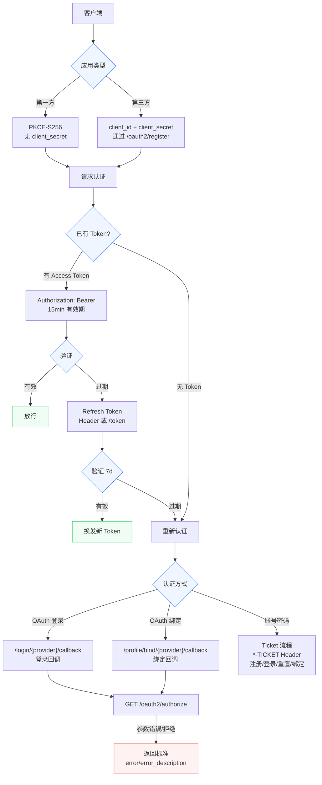
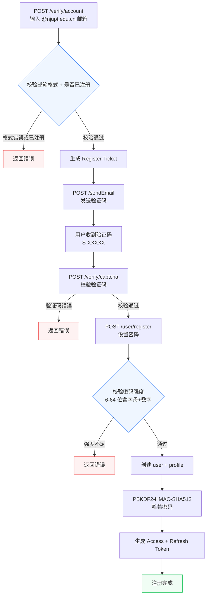
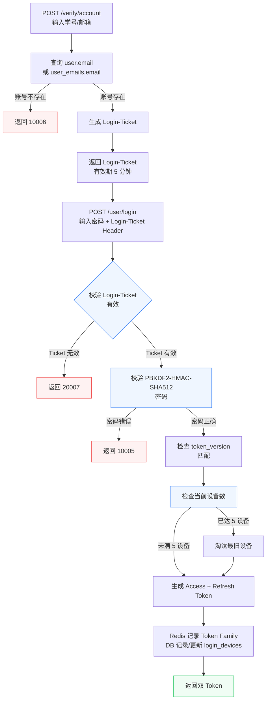
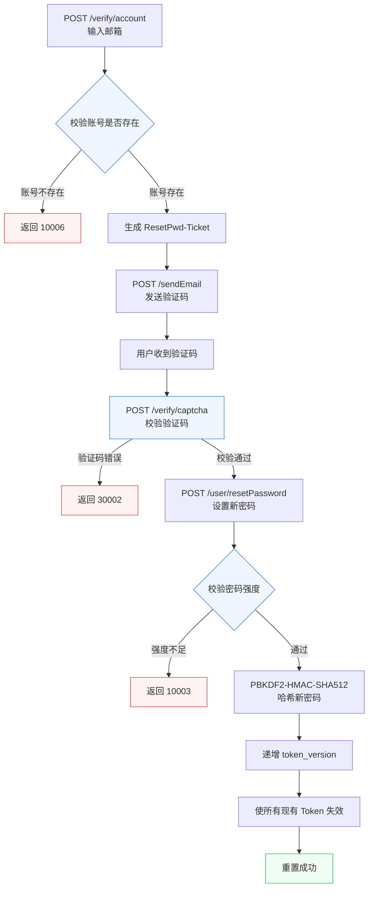
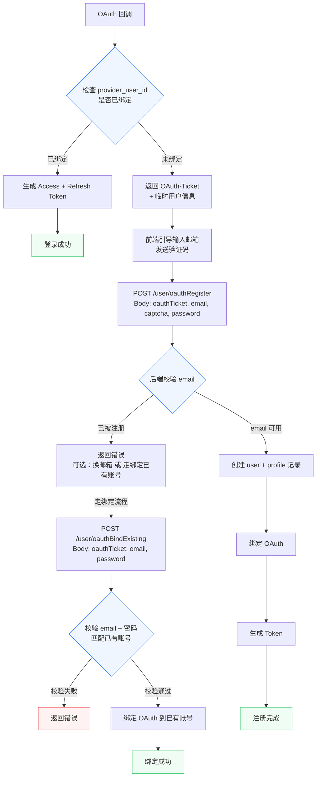
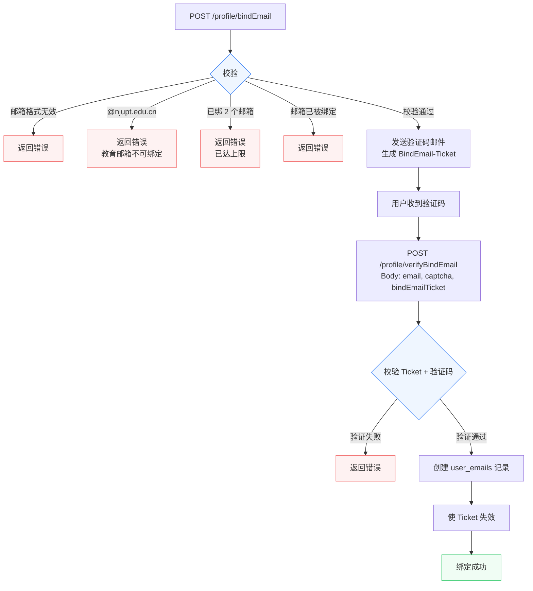
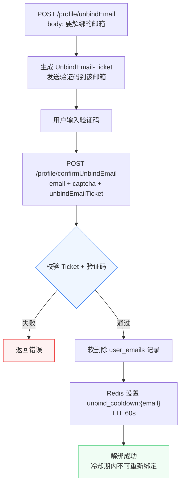
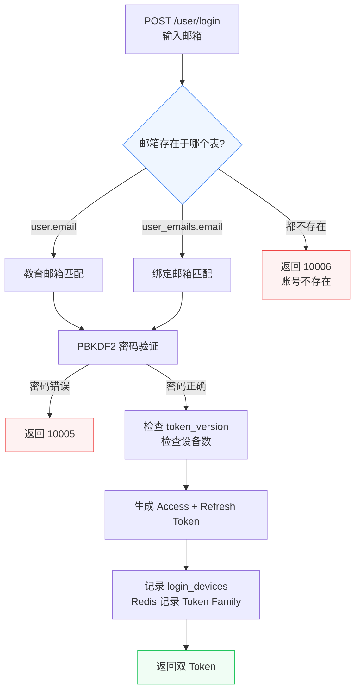
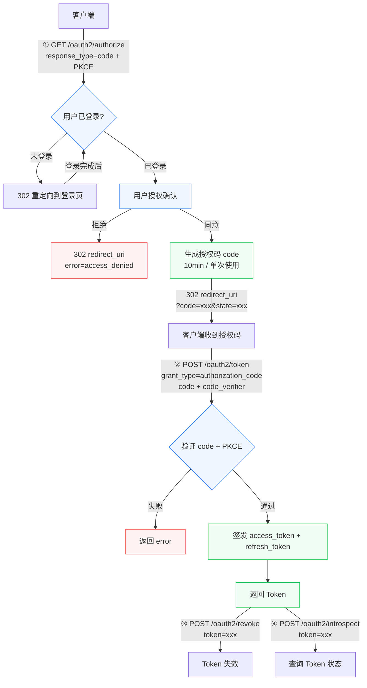

# SAST Link v2 PRD

## 1. 背景

### 1.1 定位

SAST Link 是南京邮电大学校大学生科学技术协会（SAST）的统一身份认证与人员管理系统

本项目（V2）基于一个初始项目 scaffold（Go + Gin + GORM + PostgreSQL）进行开发，直接在此基础上迭代重构，逐步实现全部功能。

### 1.2 目标

对 SAST Link 后端进行全面重构，引入 OAuth 2.1 标准作为认证授权体系，提升代码质量、可维护性和安全性。

## 2. 功能需求

同[SAST Oauth](https://njupt-sast.feishu.cn/wiki/PsalwqGZwiJyE9kjTQWcWuGknpc?from=from_copylink)

### 2.1 范围

- 账号注册/登录/登出/改密/重置密码
- 邮箱验证码
- 用户资料管理（查看/编辑/头像上传）
- GitHub / 飞书 OAuth 主动绑定/解绑 + 登录
- OAuth 首次登录注册补全教育邮箱
- 限流与防刷
- 操作日志 + 健康检查
- 头像内容审核（腾讯云 COS）
- OAuth2 授权服务端（Auth 2.1 标准）
- 管理后台
- 审计日志

### 2.2 非目标

以下功能/策略**不在 V2 范围内**：

- **API 契约**：不保证前端零改动，仅在性能或安全需求迫使时修改响应格式，需经技术评审
- **认证协议**：不限制为 JWT HS256，全面引入 OAuth 2.1 标准
- **管理后台**：第一版不实现细粒度 RBAC，仅基础成员管理
- **历史数据**：不迁移老用户历史操作日志，V2 从零开始记录
- **OAuth2 模式**：不限于授权码模式，按 OAuth 2.1 标准实现

## 3.技术架构

### 3.1技术栈

|层|技术|版本|
|---|---|---|
|语言|Go|1.26.3|
|Web 框架|Gin|v1.12.0|
|ORM|GORM|v1.31.1|
|数据库|PostgreSQL|16+（生产直连已有部署，开发用 Docker）|
|缓存|Redis|8+|
|对象存储|腾讯云 COS|—|
|邮件|SMTP|—|
|密码哈希|PBKDF2-HMAC-SHA512|—|
|认证授权|OAuth 2.1 + RS256|—|
|安全扫描|gosec + govulncheck|—|
|集成测试|testcontainers-go|—|

## 4. 功能详细说明

### 4.1 认证方式

### 4.2 注册流程

### 4.3 登录流程

**分阶段登录**：先验证账号获取 Login-Ticket，再凭 Ticket 完成登录。

### 4.4 重置密码流程

### 4.5 OAuth 注册补全流程

首次 OAuth 登录（GitHub/飞书）且未绑定任何账号时：

**uid 生成规则**：所有用户注册时系统统一生成唯一 `uid`，格式 `u{8位随机字母数字}`（如 `u7a3k9p2`），不对外暴露学号。OAuth 注册用户 `student_id` 为 NULL。

### 4.6 邮箱绑定流程

已登录用户绑定第三方邮箱：

**解绑流程**：

**登录适配**：

### 4.7 OAuth 2.1 端点

第一方应用使用 PKCE-S256，无需 client_secret。详细参数见 `docs/openapi.yaml`。

## 5. 实现顺序（Todo）

按以下顺序实现，打勾表示已完成：

* [x] 项目初始化、数据库设计、CI/CD
* [ ] 用户认证（注册 / 登录 / 验证码 / 改密 / 重置密码）
* [ ] 用户资料管理（查看 / 编辑 / 头像上传）
* [ ] OAuth 登录（GitHub / 飞书）
* [ ] OAuth 绑定 / 解绑 + 注册补全
* [ ] 限流与防刷
* [ ] 操作日志 + 健康检查
* [ ] 头像内容审核（腾讯云 COS）
* [ ] OAuth2 授权服务端（OAuth 2.1）
* [ ] OAuth2 客户端注册 API
* [ ] 管理后台
* [ ] 审计日志
* [ ] 测试、联调、上线
